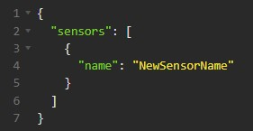

# SpringBootRESTSensor

**SpringBootRESTSensor** - это RESTful Web Service.

**Cтек технологий проекта:** _Spring Boot, PostgreSQL, Hibernate, Maven, Flyway_.

### Взаимодействие происходит со следующими сущностями:
>*- Sensor (Integer id, String name);*  
*- Measurement (Integer id, Double value, Boolean raining, Sensor sensor, LocalDateTime cteatedAt);*   

### Описание:
**Sensor** - это метеорологический датчик (далее сенсор), который измеряет температуру окружающего воздуха и может определять, идет дождь или нет.
**Measurement** - измерения сенсора.   Приложение получает данные от сенсора и сохраняет их в БД для дальнейшего анализа.   
Все получаемые данные проходят двойную валидацию (hibernate validator и spring validator):   
>*- Регистрируются сенсоры только с уникальным названием;*  
*- Измерения принимаются только от зарегистрированных сенсоров;*   
*- Пустые данные не принимаются;*   
*- Установлены лимиты по количеству символов и диапазону значений. И т.д.*   

### Endpoints:
:white_check_mark: (POST) http://localhost:8080/sensors/registration - зарегистрировать новый сенсор в БД   
:white_check_mark: (POST) http://localhost:8080/measurements/add - записать измерения сенсора в БД    
:white_check_mark: (GET) http://localhost:8080/sensors - получить список всех зарегистрированных сенсоров из БД   
:white_check_mark: (GET) http://localhost:8080/sensors/{id} - получить сенсор по id   
:white_check_mark: (GET) http://localhost:8080/measurements - получить список всех измерений из БД   
:white_check_mark: (GET) http://localhost:8080/measurements/{id} - получить измерение по id   
:white_check_mark: (GET) http://localhost:8080/measurements/rainyDaysCount - получить количество дождливых дней   

Для тестирования этого сервиса написано второе приложение-клиент - __ClientForSensor__.   
ClientForSensor взаимодействует с пользователем через консоль (куда и отдаёт полученные данные) + предоставляет график изменения температур.   

Также для тестирования можно использовать Postman или Insomnia.

|                 ***Для примера - скриншоты из Insomnia:***                 |
|:--------------------------------------------------------------------------:|
|                                        |
|                                        | 
|                                        |
|                                        |
|                                        |
|     |

### Инструкции для запуска приложения:

|             №             | Этапы выполнения                                                                                                                                                                                                                                       |
|:-------------------------:|:-------------------------------------------------------------------------------------------------------------------------------------------------------------------------------------------------------------------------------------------------------|
|             1             | [Скопируйте код на свой ПК](https://github.com/itbatia/SpringBootRESTSensor/archive/refs/heads/master.zip).                                                                                                                                            |
|             2             | Извлеките содержимое архива. В указанном месте появится папка SpringBootRESTSensor-master.                                                                                                                                                             |
|             3             | Для локального использования приложения необходимо создать свою базу данных (далее БД). Для этого выполните команду: "CREATE DATABASE SpringBootRESTSensor;". Эта команда выполняется в среде разработки во вкладке "console" или через GUI PgAdmin 4. |
|             4             | Измените файл pom.xml указав в теге <<properties>properties> свои <database.url>, <username<username>> и <password<password>>.     Соответствующие изменения внесите в файл src\main\resources\application.properties. Не забудьте обновить проект.    |
|             5             | Запустите миграцию БД выполнив команду в терминале среды разработки: "mvn flyway:migrate".                                                                                                                                                             |
| :triangular_flag_on_post: | Программа готова к использованию. Shift+F10 для запуска!                                                                                                                                                                                               |
